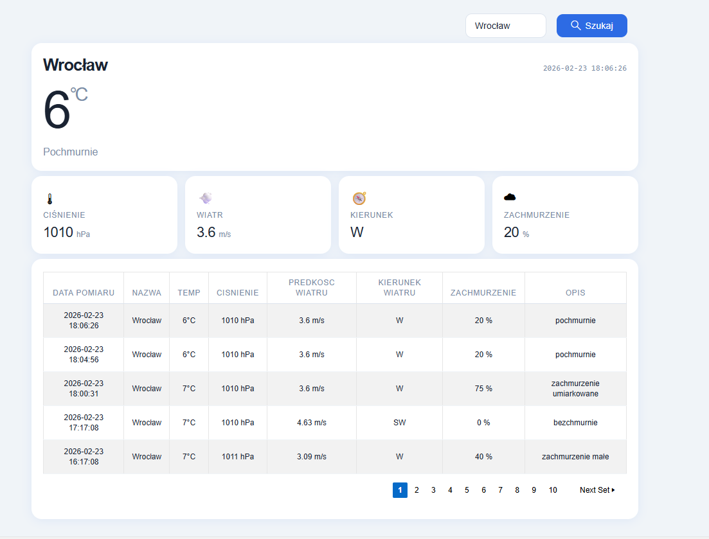

# Weather App — Oracle APEX
A weather application built in Oracle APEX that fetches weather data from an external API and presents it in a clean, readable dashboard. 

## Application tasks
 - Search for current weather conditions for any city
 - Displays live data: temperature, pressure, wind speed & direction, cloud coverage, and weather description
 - Stores measurement history with paginated table view
 - Automatically fetches data for predefined cities every hour via a scheduled job
 
## Tech Stack
| Layer | Technology |
|---|---|
|Frontend / UI | Oracle APEX |
| Backend | PL/SQL (Oracle Database) |
| Data source | [OpenWeatherMap API](https://openweathermap.org/api) |
| HTTP calls | `APEX_WEB_SERVICE.MAKE_REST_REQUEST` |
| JSON parsing | Oracle `JSON_VALUE` |
| Scheduling | Oracle DBMS_SCHEDULER (hourly job) |

## Database Structure
| Table | Description |
|---|---|
| `CITY` | List of cities with their geographic coordinates |
| `WEATHER_RAW` | Raw JSON responses from the API |
| `WEATHER_PROCESSED` | Parsed weather data in structured columns |
| `LOG_DOWNLOAD` | Download logs — status (SUCCESS/ERROR) and execution time |

## `PKG_WEATHER` Package

All backend logic is encapsulated in the `PKG_WEATHER` PL/SQL package, which contains two procedures:
`download_date_from_api(p_city_id, p_api_key)`

Handles communication with the OpenWeatherMap API.

1. Fetches city coordinates from the `CITY` table
2. Calls the REST API using `APEX_WEB_SERVICE.MAKE_REST_REQUEST`
3. Validates the response
4. Saves the raw JSON to the `WEATHER_RAW` table
5. Logs the result (execution time, status) to `LOG_DOWNLOAD`
6. On error — logs the error message and re-raises the exception

`json_process(p_city_id)`
Handles parsing raw JSON into structured data.

1. Fetches the latest record from `WEATHER_RAW` for the given city
2. Parses JSON using Oracle `JSON_VALUE` with JSONPath notation, e.g.:
	- `$.main.temp` → temperature
	- `$.wind.speed` → wind speed
	- `$.weather[0].description` → weather description
3. Inserts parsed data into the `WEATHER_PROCESSED` table

## Data Flow
OpenWeatherMap API

        │
        ▼
APEX_WEB_SERVICE.MAKE_REST_REQUEST
        │  (raw JSON)
        ▼
		
   WEATHER_RAW
        │
        ▼
		
   JSON_VALUE (parsing)
        │
        ▼
		
WEATHER_PROCESSED
        │
        ▼
		
  Oracle APEX UI
  
## Setup

### Requirements
- Oracle Database with Oracle APEX installed
- API key from [openweathermap.org](https://openweathermap.org/api) (free tier is sufficient)
- Database ACL configured to allow outbound HTTP calls

### Running the job
A `DBMS_SCHEDULER` job runs `PKG_WEATHER.download_date_from_api` every hour for each city defined in the `CITY` table.

### Adding a city
Simply insert a record into the `CITY` table with the city name and its geographic coordinates 
(`WIDTH` for latitude, `LENGTH` for longitude) — the job will automatically start fetching data for it.

### Screenshot
